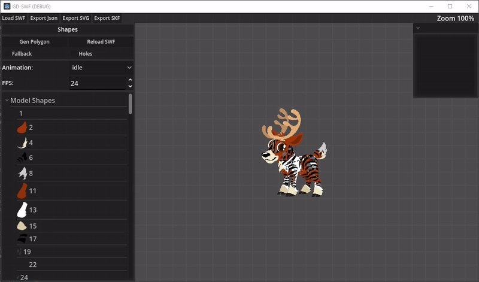

# GD-SWF
A simple character SWF previewer and exporter made for porting SWF data to other software. (WIP)

Made using Godot 4.6 NET and swflib.

This is a software designed to help port SWF character models (for games) to game engines and other software.
<br>It is still a big work in progress and may be a bit slow due to lack of resources.</br>
<br>Keep in mind that this is a hobby project, don't expect something too polished or professional!</br>

Feel free to check the SWFPlayer script to see how I personally render the data directly from the polygons.

Special thanks to RetroPaint for helping and letting me work on a Skelform export too :D


### Help needed

- Fix the parenting issue with some swf where some items don't get parented for some reason? 

---

### SWF -> Json minimal export structure.

```
{
  "Sprites": {
    "0": {
      "SpriteName" : "Test",
      "MaxDepth": 2,
      "Frames": [
        {
          "0": {
            "SymbolID": 1,
            "X": 0,
            "Y": 0,
            "ScaleX": 1,
            "ScaleY": 1,
            "Rotation": 0,
            "TransformMatrix": [1, 0, 0, 1, 0, 0],
            "Visible": true,
            "Alpha": 1,
            "LocalX": 0,
            "LocalY": 0,
            "IsDirty": true,
            "Color": { "R": 1, "G": 1, "B": 1, "A": 1 }
          },
          "1": {
            "SymbolID": 2,
            "X": 150,
            "Y": 0,
            "ScaleX": 1,
            "ScaleY": 1,
            "Rotation": 0,
            "TransformMatrix": [1, 0, 0, 1, 150, 0],
            "Visible": true,
            "Alpha": 1,
            "LocalX": 150,
            "LocalY": 0,
            "IsDirty": true,
            "Color": { "R": 1, "G": 1, "B": 1, "A": 1 }
          }
        }
      ],
      "Animations": {
        "Idle": [0]
      },
      "Children": [
        { "ID": 2, "Type": "Sprite" }
      ]
    },

    "2": {
      "MaxDepth": 1,
      "Frames": [
        {
          "0": {
            "SymbolID": 1,
            "X": 0,
            "Y": 0,
            "ScaleX": 0.5,
            "ScaleY": 0.5,
            "Rotation": 0,
            "TransformMatrix": [0.5, 0, 0, 0.5, 0, 0],
            "Visible": true,
            "Alpha": 1,
            "LocalX": 0,
            "LocalY": 0,
            "IsDirty": true,
            "Color": { "R": 1, "G": 1, "B": 1, "A": 1 }
          }
        }
      ],
      "Animations": {
        "Idle": [0]
      },
      "Children": []
    }
  },

  "Shapes": {
    "1": {
      "Subpaths": [
        {
          "Segments": [
            {
              "Type": "line",
              "Start": { "X": 0, "Y": 0 },
              "End": { "X": 100, "Y": 0 }
            },
            {
              "Type": "line",
              "Start": { "X": 100, "Y": 0 },
              "End": { "X": 50, "Y": 100 }
            },
            {
              "Type": "line",
              "Start": { "X": 50, "Y": 100 },
              "End": { "X": 0, "Y": 0 }
            }
          ],
          "Lines": [
            {
              "Type": "line",
              "Start": { "x": 0, "y": 0 },
              "End": { "x": 100, "y": 0 },
              "Control": { "x": 0, "y": 0 }
            }
          ],
          "Polygons": [
            [
              { "x": 0, "y": 0 },
              { "x": 100, "y": 0 },
              { "x": 50, "y": 100 }
            ]
          ],
          "Triangles": {
            "Points": [
              { "x": 0, "y": 0 },
              { "x": 100, "y": 0 },
              { "x": 50, "y": 100 }
            ],
            "Indices": [0, 1, 2]
          },
          "Color": { "R": 1, "G": 0, "B": 0, "A": 1 }
        }
      ],
      "Offset": { "x": 0, "y": 0 },
      "Size": { "x": 100, "y": 100 },
      "Svg_text": "" //The software auto generates svg string data from shapes.
    }
  },

  "AnimatedSpriteID": 0,
  "ModelPlacement": { "x": 0, "y": 0 },
  "FPS": 24
}

```

---

Maybe upcoming features:
- Morphs support.
- Better polygon and nested color mapping generation.
- An export to Godot Animation player.
- A portable Godot resource export instead of Json.
- Xml export (only if wanted. I don't like dealing with them..)
- Full SWF animation data export (Tho scripted stuff will be left out unless someone figured that out, I guess?)
- Release Builds.

---

### Example Import of the Reindeer from the old game Happy Pets.




